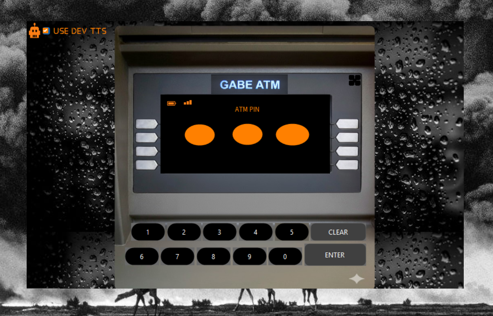
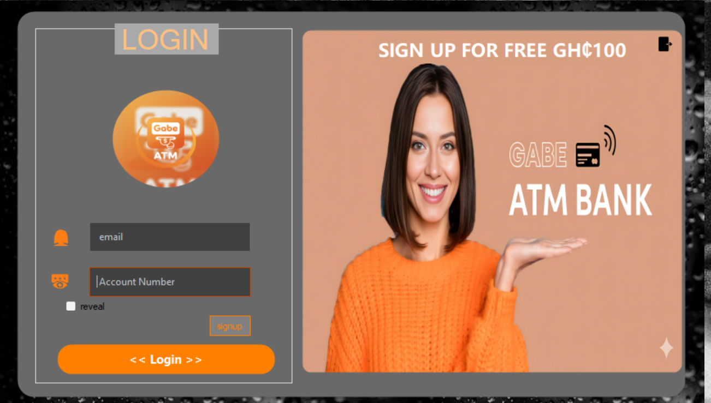
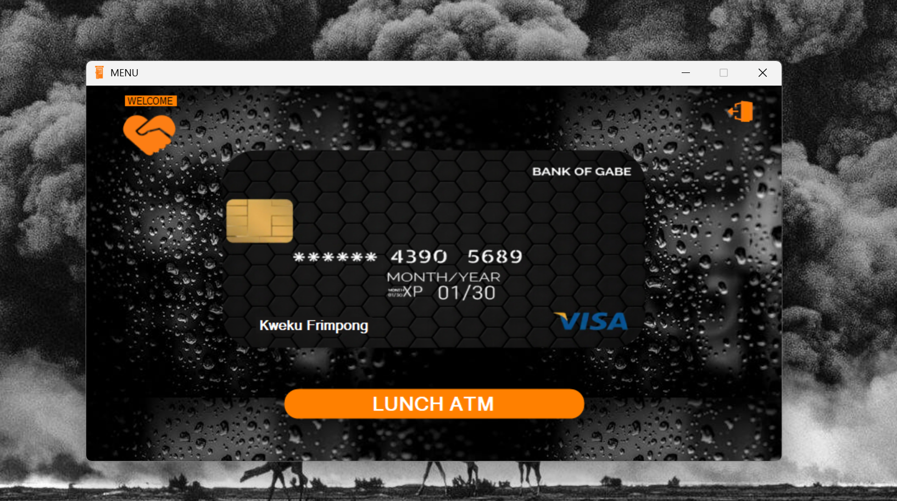

# 🏦 VB Bank Simulator — Voice-Enabled Accessibility Banking System

<p align="center">
  
  
  
</p>

> An inclusive banking simulation built with **Visual Basic (.NET)**, engineered around one core principle: accessibility first. Integrated **text-to-speech voice output** reads balances, transaction prompts, and confirmations aloud in real time — giving visually impaired users the independence to check balances, deposit, and withdraw funds entirely on their own.

<p align="center">
  
</p>

---

## 🎥 Video Demonstration

<p align="center">
  <a href="https://youtu.be/NFax1EN84bE" target="_blank">
    
  </a>
</p>

<p align="center">
  <sub>Hear the voice accessibility engine in action — from login to balance check to a full deposit/withdrawal flow.</sub>
</p>

> *(Swap the `#` above for your actual YouTube link once the video is uploaded.)*

---

## 💡 Why This Project Exists

Most banking software is built visual-first — dense screens, small buttons, no audio path for someone who can't see the interface. VB Bank Simulator flips that assumption: every core action produces a spoken confirmation alongside its visual counterpart, so a blind or visually impaired user never has to guess whether a transaction succeeded. It's a small-scale demonstration of how accessibility can be a first-class design constraint rather than an afterthought bolted onto a finished app.

---

## ✨ Core Features

| Feature | Description |
|---|---|
| 🗣️ **Voice speech accessibility engine** | Built-in text-to-speech that audibly announces account balances, transaction prompts, deposit successes, and withdrawal details in real time. |
| 💼 **Account management** | Create and manage user profiles with unique account details, guided by matching audio prompts. |
| 💸 **Accessible transaction processing** | Deposits and withdrawals execute with both an on-screen visual cue and a clear spoken confirmation, reducing input errors. |
| 🔒 **Secure verification** | Input validation paired with audio feedback guides the user safely through every step of the banking process. |

---

## 🔄 How It Works

```
User Action (login, deposit, withdraw)
              │
              ▼
   Input Validation & Verification
              │
              ▼
   Transaction Logic (VB.NET)
              │
              ▼
   System.Speech Text-to-Speech Engine
              │
              ▼
   Spoken Confirmation + Visual Update
```

Every transaction path in the app is dual-channel by design: the same event that updates the on-screen balance also triggers a `System.Speech.Synthesis` call, so the visual and audio outputs are always in sync — never one without the other.

---

## 📸 Interface Gallery

<table>
  <tr>
    <td width="33%" align="center">
      <b>Login</b><br>
      <br>
      <sub>Secure account sign-in with spoken prompts.</sub>
    </td>
    <td width="33%" align="center">
      <b>Main menu</b><br>
      <br>
      <sub>Voice-guided navigation between account actions.</sub>
    </td>
    <td width="33%" align="center">
      <b>ATM panel</b><br>
      <br>
      <sub>Deposit, withdraw, and balance checks with audio confirmation.</sub>
    </td>
  </tr>
</table>

---

## 🛠️ Tech Stack

| Domain | Technologies Used |
|---|---|
| **Language** | Visual Basic (VB.NET) |
| **Framework** | .NET Framework — `System.Speech.Synthesis` for text-to-speech |
| **Environment** | Visual Studio |

---

## 🚀 Getting Started

### Prerequisites
- Visual Studio (with .NET Framework support)
- Speakers or headphones to hear the voice accessibility features

### 1. Clone the repository
```bash
git clone https://github.com/DevTsamenyGabriel/CppBankSimulator.git
cd CppBankSimulator
```

### 2. Open in Visual Studio
- Open Visual Studio
- Select **Open a project or solution**
- Navigate to the cloned folder and open the solution file (`.sln` / `.vbproj`)

### 3. Run the application
- Click **Start** in Visual Studio, or press `F5` to build and launch
- Make sure your speakers or headphones are active to experience the voice accessibility engine

---

## 📂 Repository Structure

| Path | Description |
|---|---|
| `*.vb` | Core source code — business logic, event handlers, and text-to-speech engine integration |
| `*.sln` / `*.vbproj` | Visual Studio solution and project configuration files |
| `github_Assets/` | Screenshots used in this README |

---

## 🗺️ Roadmap

- [ ] Multi-language voice support
- [ ] Configurable speech rate and volume
- [ ] Screen-reader (NVDA/JAWS) compatibility testing
- [ ] Transaction history with audio playback

---

## 📄 License

Distributed under the MIT License. See `LICENSE` for details.
